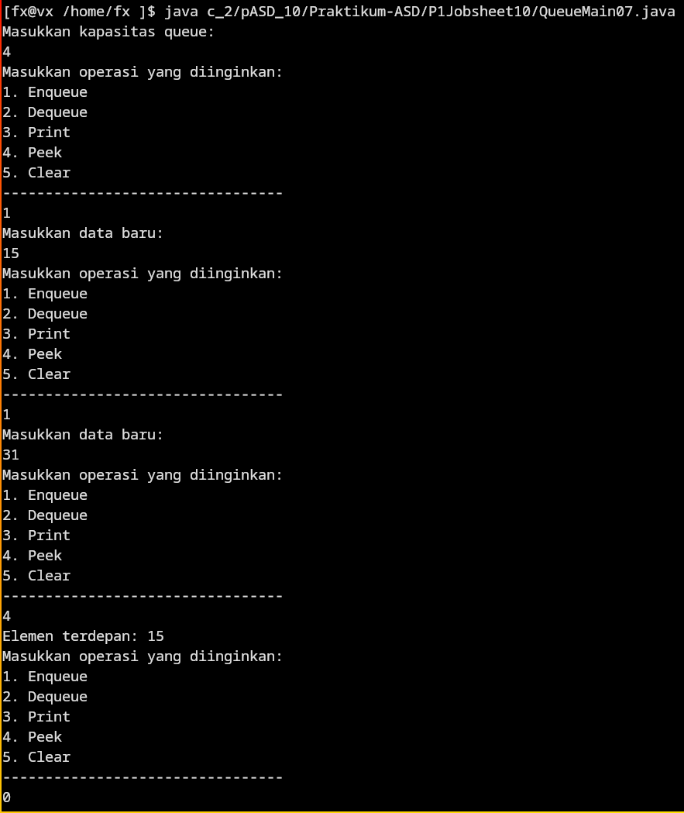
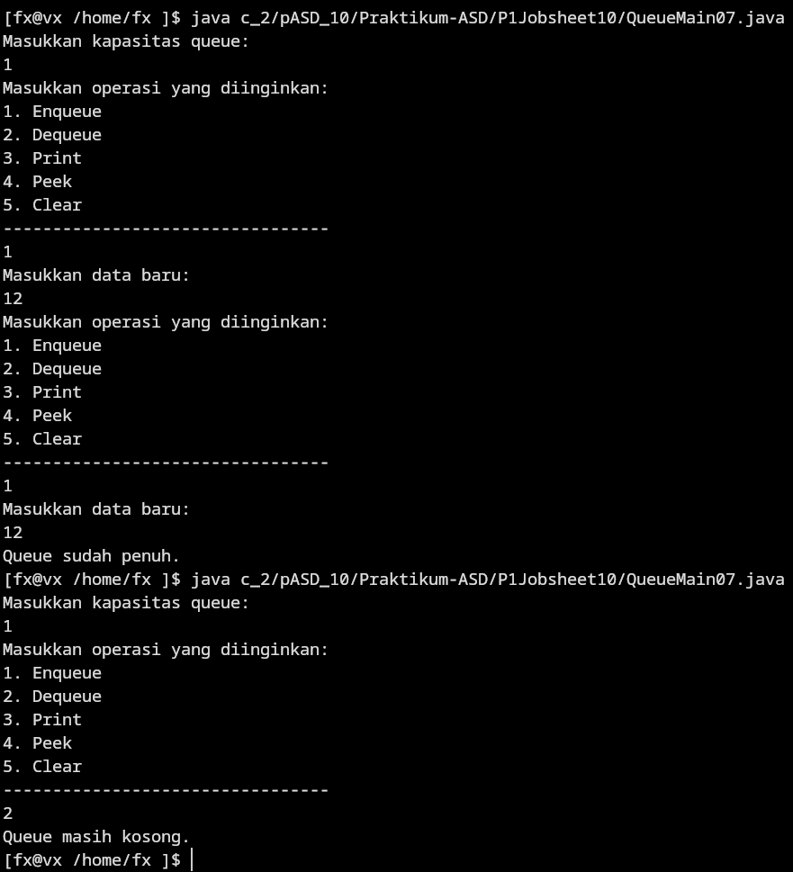

# Jobsheet 10 - Queue (Antrian)

## [Latihan Praktikum](#latihan-praktikum) | [Daftar Percobaan](#daftar_percobaan)

---

# Daftar_Percobaan
- [Praktikum 1](#praktikum_1)
  - [Pertanyaan](#pertanyaan_praktikum_1)
  - [Jawaban](#jawaban_praktikum_1)
- [Praktikum 2](#praktikum_2)
  - [Pertanyaan](#pertanyaan_praktikum_2)
  - [Jawaban](#jawaban_praktikum_2)


## Praktikum_1
- [Queue07.java](P1Jobsheet10/Queue07.java)
- [QueueMain07.java](P1Jobsheet10/QueueMain07.java)

[Kembali ke #Daftar_Percobaan](#daftar_percobaan)
### Output_Praktikum_1

<details>
<summary><b>Screenshot Output</b></summary>


</details>

### Pertanyaan_Praktikum_1

1. Pada konstruktor, mengapa nilai awal atribut `front` dan `rear` bernilai -1, sementara atribut `size` bernilai 0?
2. Pada method `Enqueue`, jelaskan maksud dan kegunaan dari potongan kode berikut:
   ```java
   if (rear == max - 1) {
       rear = 0;
   }
   ```
3. Pada method `Dequeue`, jelaskan maksud dan kegunaan dari potongan kode berikut:
   ```java
   if (front == max - 1) {
       front = 0;
   }
   ```
4. Pada method `print`, mengapa pada proses perulangan variabel `i` tidak dimulai dari 0 (`int i=0`), melainkan `int i=front`?
5. Perhatikan kembali method `print`, jelaskan maksud dari potongan kode berikut:
   ```java
   i = (i + 1) % max;
   ```
6. Tunjukkan potongan kode program yang merupakan queue overflow!
7. Pada saat terjadi queue overflow dan queue underflow, program tersebut tetap dapat berjalan dan hanya menampilkan teks informasi. Lakukan modifikasi program sehingga pada saat terjadi queue overflow dan queue underflow, program dihentikan!

[Kembali ke #Daftar_Percobaan](#daftar_percobaan)

### Jawaban_Praktikum_1

1. Nilai `front` dan `rear` diinisialisasi -1 untuk menunjukkan bahwa queue masih kosong, dan -1 menunjukkan bahwa nilai tidak valid karena di luar indeks array. `size` diinisialisasi 0 karena belum ada elemen dalam queue.

2. Potongan kode menunjukkan operasi wrap-around (pembungkusan) pada queue melingkar (circular queue). Saat pointer `rear` mencapai akhir array, pointer mengulang ke depan (0) untuk memanfaatkan kembali ruang di awal array yang dikosongkan operasi `Dequeue`, agar queue dapat menggunakan ruang penyimpanan secara efisien.

3. Sama seperti pada `Enqueue`, ketika `front` mencapai `max-1` pointer diulang ke 0 agar indeks tetap melingkar dan traversal berlanjut.

4. `i` dimulai dari `front` karena `i` menunjuk elemen terdepan yang masih valid, mulai dari 0 bisa mencetak elemen yang sudah dihapus.

5. `i = (i + 1) % max;` melakukan wrap-around menggunakan modulo sehingga indeks kembali ke 0 setelah mencapai akhir array.

6. Overflow terjadi saat `size == max`. Dicek oleh `IsFull()` dan ditangani di `Enqueue` (contoh menampilkan "Queue sudah penuh"), misalnya:
```java
public boolean IsFull(){
  return size == max;
}
```
Pada kondisi overflow, program tidak menambahkan elemen baru.

7. Dengan menambahkan `System.exit(1);` pada perintah statement if positif pada fungsi `Enqueue` dan `Dequeue` program akan exit setelah menapilkan pesan over/under-flow.  

[Kembali ke #Daftar_Percobaan](#daftar_percobaan)

---

## Praktikum_2
- [Mahasiswa07.java](P2Jobsheet10/Mahasiswa07.java)
- [AntrianLayanan07.java](P2Jobsheet10/AntrianLayanan07.java)
- [LayananAkademikSIAKAD07.java](P2Jobsheet10/LayananAkademikSIAKAD07.java)   

[Kembali ke #Daftar_Percobaan](#daftar_percobaan)

### Output_Praktikum_2
<details>
<summary><b> Output</b></summary>

```text
[fx@vx /home/fx ]$ java c_2/pASD_10/Praktikum-ASD/P2Jobsheet10/LayananAkademikSIAKAD07.java

=== Menu Antrian Layanan Akademik ===
1. Tambah Mahasiswa ke Antrian
2. Layani Mahasiswa
3. Lihat Mahasiswa Terdepan
4. Lihat Semua Antrian
5. Jumlah Mahasiswa dalam Antrian
0. Keluar
Pilih menu: 1
NIM     : 123
Nama    : Evan
Prodi   : TI
Kelas   : 2B
Evan berhasil masuk ke antrian.

=== Menu Antrian Layanan Akademik ===
1. Tambah Mahasiswa ke Antrian
2. Layani Mahasiswa
3. Lihat Mahasiswa Terdepan
4. Lihat Semua Antrian
5. Jumlah Mahasiswa dalam Antrian
0. Keluar
Pilih menu: 1
NIM     : 122
Nama    : Theo
Prodi   : TI
Kelas   : T3
Theo berhasil masuk ke antrian.

=== Menu Antrian Layanan Akademik ===
1. Tambah Mahasiswa ke Antrian
2. Layani Mahasiswa
3. Lihat Mahasiswa Terdepan
4. Lihat Semua Antrian
5. Jumlah Mahasiswa dalam Antrian
0. Keluar
Pilih menu: 4
Daftar Mahasiswa dalam Antrian:
NIM - NAMA - PRODI - KELAS
1. 123 - Evan - TI - 2B
2. 122 - Theo - TI - T3

=== Menu Antrian Layanan Akademik ===
1. Tambah Mahasiswa ke Antrian
2. Layani Mahasiswa
3. Lihat Mahasiswa Terdepan
4. Lihat Semua Antrian
5. Jumlah Mahasiswa dalam Antrian
0. Keluar
Pilih menu: 2
Melayani mahasiswa: 
123 - Evan - TI - 2B

=== Menu Antrian Layanan Akademik ===
1. Tambah Mahasiswa ke Antrian
2. Layani Mahasiswa
3. Lihat Mahasiswa Terdepan
4. Lihat Semua Antrian
5. Jumlah Mahasiswa dalam Antrian
0. Keluar
Pilih menu: 4
Daftar Mahasiswa dalam Antrian:
NIM - NAMA - PRODI - KELAS
1. 122 - Theo - TI - T3

=== Menu Antrian Layanan Akademik ===
1. Tambah Mahasiswa ke Antrian
2. Layani Mahasiswa
3. Lihat Mahasiswa Terdepan
4. Lihat Semua Antrian
5. Jumlah Mahasiswa dalam Antrian
0. Keluar
Pilih menu: 5
Jumlah dalam antrian: 1

=== Menu Antrian Layanan Akademik ===
1. Tambah Mahasiswa ke Antrian
2. Layani Mahasiswa
3. Lihat Mahasiswa Terdepan
4. Lihat Semua Antrian
5. Jumlah Mahasiswa dalam Antrian
0. Keluar
Pilih menu: 0
Terima kasih.
[fx@vx /home/fx ]$ 
```

<!--  -->

</details>

### Pertanyaan_Praktikum_2

Lakukan modifikasi program dengan menambahkan method baru bernama `LihatAkhir` pada class `AntrianLayanan` yang digunakan untuk mengecek antrian yang berada di posisi belakang. Tambahkan pula daftar menu `6. Cek Antrian paling belakang` pada class `LayananAkademikSIAKAD` sehingga method `LihatAkhir` dapat dipanggil!

[Kembali ke #Daftar_Percobaan](#daftar_percobaan)

### Jawaban_Praktikum_2

[Kembali ke #Daftar_Percobaan](#daftar_percobaan)

---